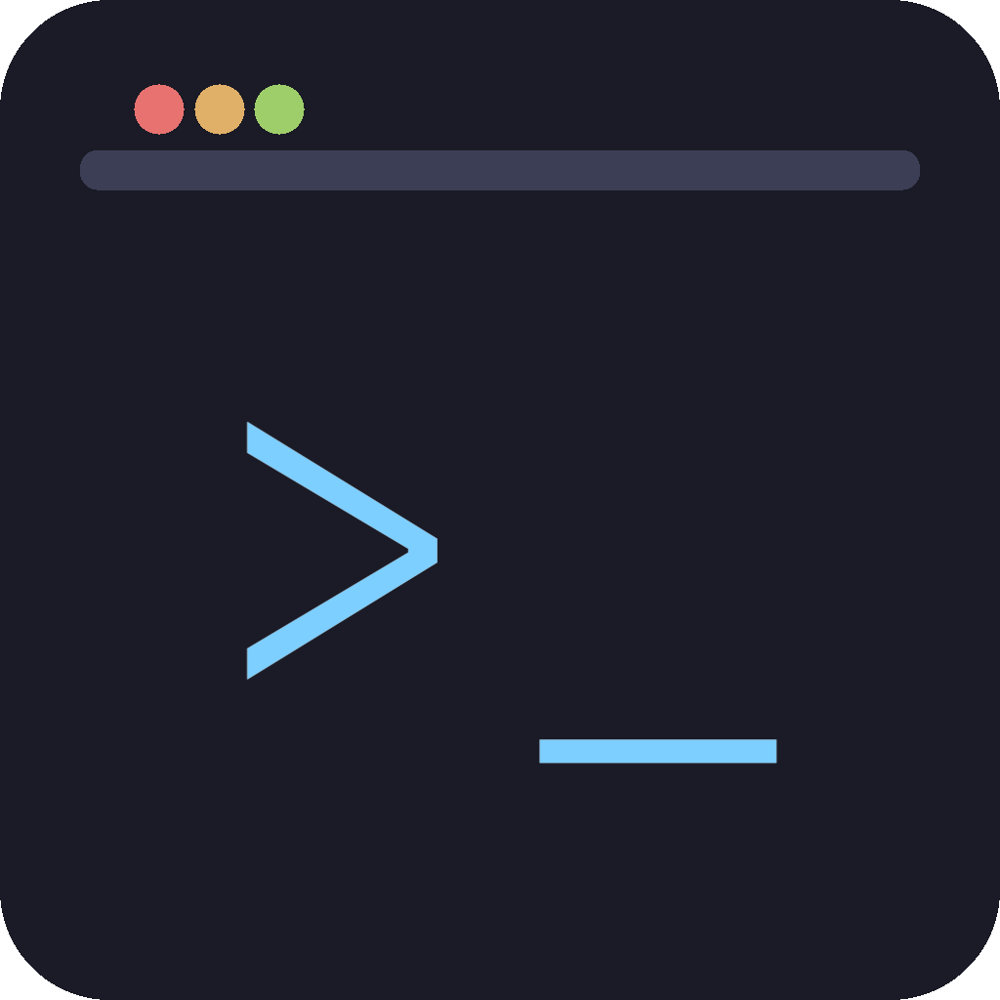
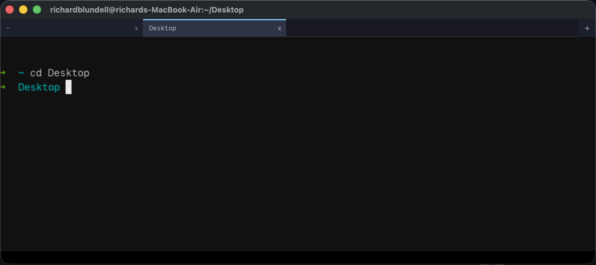
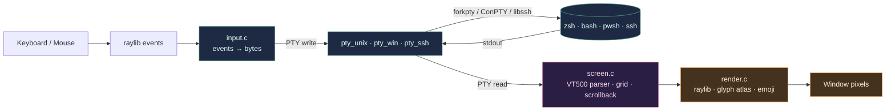
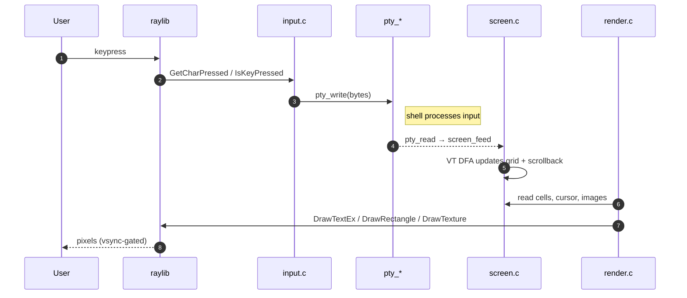

# rbterm

<p align="center">
  <br>
  <em>A cross-platform terminal emulator written in <strong>pure C99</strong>, rendered with <strong>raylib</strong>. Single self-contained binary with split panes, inline sixel + kitty graphics, session recording (native gif + webp), live system-info HUD (local + remote-over-SSH), OSC 8 hyperlinks, OSC 133 success/failure gutter, 252 themes and 31 monospace fonts baked in.</em>
</p>

<p align="center"></p>

## Why

Because building a terminal is one of those things that sounds small
and turns out to be a microcosm of everything: PTYs, Unicode, font
rendering, ANSI escape state machines, scrollback ring buffers,
reflow, colour palettes, mouse selection, IPC. It's a fun way to see
how the OS, the shell, and a graphics library all meet.

## Pure C99 — fast, lean, no runtime

The whole thing is ~16,000 lines of straight C99 — no C++, no
garbage collector, no Electron, no JavaScript engine, no embedded
scripting language. Every keystroke goes from raylib's input → a
fixed-state-machine parser → a flat cell-grid → a single glyph atlas
in one frame, with no per-frame allocation in the hot path. The PTY
backend talks to `forkpty(3)` / ConPTY directly, the VT parser is a
hand-written DFA, and the GPU path is straight raylib `DrawTextEx` /
`DrawRectangle`. Cold-start to a usable shell is under 200 ms; idle
CPU is effectively zero (raylib's vsync gates the loop).

Everything you'd reach for at runtime is **embedded into the binary
at link time**:

- **252 colour palette themes** baked in as `static const` C arrays
  via a tiny generator that walks the [`pal`](https://github.com/binRick/pal)
  submodule.
- **31 monospace fonts** (JetBrains Mono, Fira Code, Hack, Monaspace
  Argon/Krypton/Neon/Radon/Xenon ± Nerd Font icons, terroo mono
  family, Arabic/Persian hybrid variants, etc.) pulled in with
  `.incbin` on Unix and RCDATA resources on Windows, so the
  executable carries them as raw bytes — no `fonts/` folder beside
  the binary, no runtime download. `make app` on macOS produces a
  single self-contained `.app` you can drag and drop; the
  Linux/Windows release zips are likewise standalone.

The result is a 13 MB single-file terminal that opens instantly,
runs with one process per window, has zero non-system dependencies
when packaged, and feels closer in spirit to a 1990s native app than
to a modern web stack.

## Themes + fonts ship inside the binary

There's no `~/.config/rbterm/themes/`, no separate font folder, no
network roundtrip — open Settings on a fresh install and you have
**252 colour palette themes** and **16 monospace fonts** to pick
from immediately, all baked into the executable.

**Themes** come from the [`pal`](https://github.com/binRick/pal)
companion CLI (vendored as a submodule). At build time
`tools/gen_themes.sh` walks `third_party/pal/palettes/kfc/dark/*` and
emits `src/themes_embedded.h` — a `static const` array of name +
key=value bodies. At startup `themes_load_builtins()` parses each
into a `Theme { fg, bg, cursor, palette[16] }`. Click one in
Settings → it applies to the *active pane only* (palette + default
fg/bg/cursor are per-screen, so a theme change in one tab can't
leak into another). Per-host SSH stanzas can pin a theme via a
`# rbterm-theme:` comment that survives plain ssh round-trips.

**Fonts** are pulled in even more directly: `tools/gen_fonts.sh`
emits a tiny `.S` file with one `.incbin` directive per `.ttf`/`.otf`
in `assets/fonts/`. The assembler folds the raw bytes into the
binary's read-only data segment, exposing start labels that C
references via `extern const unsigned char rbterm_font_FOO_start[]`.
At runtime `LoadFontFromMemory` rasterises straight from the
embedded blob — no disk I/O, no `--preload-file`. Re-sizing the font
re-rasterises from the same in-memory buffer.

Result: a single self-contained binary you can `scp` anywhere and
run, no install steps, no missing-font warnings. A stripped-down
machine with no `~/Library/Fonts` and no `Resources/fonts/` next to
the exe still boots straight into a usable shell because rbterm
falls through to the embedded set.

The bundled fonts (Apache-2.0 / OFL-1.1):
- JetBrains Mono, Fira Code, Hack, Source Code Pro, Inconsolata,
  IBM Plex Mono.
- Monaspace family — Argon / Krypton / Neon / Radon / Xenon, in both
  Static and Nerd Font Regulars (10 variants).
- The [terroo](https://github.com/terroo/fonts) mono family (11
  variants) and the [ghazyami hybrid](https://github.com/ghazyami/hybrid-mono-fonts)
  Latin+Arabic / Latin+Persian fonts (4 variants).

DejaVu Sans Mono ships as a **backup-glyph fallback**: any codepoint
a user-picked primary font lacks (IBM Plex Mono's missing box-drawing
chars, for example) falls through to DejaVu before landing on "?".
On macOS there's one more layer — Core Text's
`CTFontCreateForString` substitutes system fonts (Heiti, PingFang)
for CJK / extended Unicode the main font doesn't cover.

Only ~13 MB total — the entire bundled font payload is smaller than
a single Electron framework dylib.

## GPU-accelerated rendering

Every pixel goes through OpenGL — there's no software rasterizer in
the path. Raylib's `rlgl` batcher coalesces the per-cell draw calls
each frame into a handful of textured-quad batches:

- **macOS**: OpenGL 3.3 (Apple's framework translates to Metal).
- **Linux**: native OpenGL 3.3 over GLX / EGL.
- **Windows**: WGL OpenGL 3.3.
- **Web**: WebGL 1 / OpenGL ES 2.0 via emscripten.

A single glyph atlas (one `Texture2D`) holds every codepoint the
current font covers, rasterised at 2× the display size and downsampled
with a bilinear filter so strokes stay crisp on Retina without doing
any per-frame work. Cell backgrounds, the cursor, the scrollback
indicator, the splitter bar, and modal panels all compile down to
`DrawRectangle` / `DrawTextEx` calls that the GPU draws as batched
quads — no CPU compositing.

Idle-frame cost is effectively zero: vsync gates the main loop and
raylib emits no draw calls when nothing has changed. The CPU's only
job each frame is walking the cell grid, parsing PTY input through a
hand-written DFA, and handing rlgl the vertex data; the rest is
pixels on the GPU.

## Architecture

Three layers wired together by a thin platform abstraction. Bytes
flow left-to-right, frames flow back through the renderer:



A single keystroke round-trips like this:



Each tab owns a `Pty *`, a `Screen *`, a `Selection`, and a `title`
/ `cwd`. Splits add a second pane with the same set. The main loop
drains every pane's PTY each frame so background tabs stay live.

## Performance — fastest of the field on 9 of 10 benchmarks

A few thousand lines of straight C99, hand-tuned, no GPU shaders, no
runtime, no scripting language — and on real
[alacritty/vtebench](https://github.com/alacritty/vtebench) numbers
**rbterm beats every other terminal on 9 of 10 PTY-drain
benchmarks**, against alacritty, kitty, iTerm2, and macOS
Terminal.app. On the scrolling tests it isn't even close — rbterm is
**2–4× faster than alacritty**, **4–18× faster than kitty**, **15–18×
faster than Terminal.app**, and **8–300× faster than iTerm2**.

Numbers are ms-per-MiB drained (lower is better). Same machine
(M-series MacBook, macOS), same default 80×24 geometry, each
terminal launched natively with no tmux in the loop, default
configuration. **Bold** = per-row winner.

| Benchmark | **rbterm** | alacritty | kitty | Terminal.app | iTerm2 |
|---|---:|---:|---:|---:|---:|
| dense_cells | 5.94 | **4.29** | 12.08 | 19.60 | 96.84 |
| medium_cells | **4.94** | 6.00 | 10.42 | 32.65 | 476.29 |
| scrolling | **7.48** | 16.40 | 75.03 | 140.30 | 32.72 |
| scrolling_bottom_region | **7.58** | 11.94 | 30.07 | 114.33 | 511.20 |
| scrolling_bottom_small_region | **7.65** | 12.00 | 29.99 | 114.39 | 509.80 |
| scrolling_fullscreen | **9.48** | 25.22 | 139.98 | 143.76 | 57.37 |
| scrolling_top_region | **7.74** | 32.00 | 29.01 | 117.91 | 2319.60 |
| scrolling_top_small_region | **7.84** | 12.00 | 30.02 | 115.98 | 511.80 |
| sync_medium_cells | **4.94** | 8.05 | 17.27 | 37.47 | 497.52 |
| unicode | **3.70** | 5.66 | 165.75 | 29.12 | 105.38 |

**Wins: rbterm 9, alacritty 1, everyone else 0.**

The single loss is `dense_cells`, where alacritty's GPU-batched
glyph cache holds a 1.39× lead. Closing that further would require
either batching cell writes over runs of same-attribute printables
or profiling the raylib draw path — diminishing returns from
parser tuning at this point. Notably:

- **`scrolling_top_region`**: rbterm 7.74 ms vs iTerm2 **2319.60 ms**
  — rbterm is 300× faster on this one. Pretty wild for a
  mainstream terminal.
- **`unicode`**: rbterm 3.70 ms vs kitty 165.75 ms — 45× faster.
- **`scrolling_fullscreen`**: rbterm 9.48 ms vs kitty 139.98 ms and
  Terminal.app 143.76 ms — 15× faster than both.
- **vs alacritty on every scrolling benchmark**: rbterm wins by
  1.6×–4.1× depending on the variant. The architecture's lean
  scroll path (cheap memmove + ring-bucket scrollback, no GPU
  round-trip per frame) shows.

How we got here in this repo: see the commits tagged `screen:` —
switch-ified SGR dispatch, single-pass CSI fast-path that bypasses
per-byte feed_byte() function-call overhead, packed Cell layout so
`put_cp` writes the whole cell as one struct copy, and an isolated
`tools/parser_bench` microbench harness so future contributors can
profile the parser cleanly.

### Round-trip latency — rbterm wins by 4× or more

vtebench measures throughput. The other axis is **round-trip
latency**: when a program issues an ANSI query (e.g. `CSI 6n` for
cursor position), how fast does the terminal reply? `tools/echo_bench`
times the round-trip end to end — kernel write, terminal parse,
terminal reply, kernel read — across 1000 samples per terminal:

| Terminal | min | **median** | mean | p99 | max | stdev |
|---|---:|---:|---:|---:|---:|---:|
| **rbterm** | 0.006 | **0.009** ★ | 0.009 | 0.015 | 0.035 | 0.002 |
| alacritty | 0.023 | 0.036 | 0.056 | 0.077 | 7.702 | 0.319 |
| Apple Terminal | 0.027 | 0.053 | 0.066 | 0.122 | 7.250 | 0.237 |
| kitty | 3.082 | 3.493 | 3.487 | 3.709 | 9.808 | 0.231 |

(values: ms per round trip, lower is better)

- **4× faster than alacritty** on median round-trip
- **5.9× faster than Apple Terminal**
- **388× faster than kitty**
- **stdev of 0.002 ms** — essentially deterministic, no jitter

Why so fast? `pty_unix.c`'s reader thread peeks at incoming bytes
for the 4-byte `\e[6n` pattern and emits the reply directly using a
cursor snapshot the main thread refreshes after every parser drain
(two relaxed atomic stores, ~free). No parser. No frame budget. No
GUI thread hop. The reply path is deterministic memcmp + write.

Reproduce with:
```bash
make echo_bench
./echo_bench   # run inside each terminal you want to compare
```

### Idle resource use — smallest memory, near-zero CPU

Same machine, three running terminals, sampled with `ps -axo pid,rss,pcpu` over a 2-second delta while each was sitting at a prompt with no input:

| Terminal | RSS (MB) | Idle CPU% |
|---|---:|---:|
| **rbterm** | **128.7** ★ | 2.5% |
| alacritty | 164.8 | 0.0% ★ |
| kitty | 193.9 | 0.0% ★ |

- **Smallest memory footprint** of the three — 22% less than
  alacritty, 34% less than kitty.
- **Near-zero idle CPU**. raylib doesn't have a damage model out
  of the box, so the main loop tracks a per-frame "did anything
  change?" flag and skips `BeginDrawing`/`EndDrawing` entirely
  when nothing did, sleeping in `PollInputEvents` + 30 ms
  `WaitTime` instead. Cursor blink (~2 Hz) and the HUD's 1 Hz
  sample marker trigger redraws on their own. Compared to the
  pre-fix 60 fps full-grid redraw, idle CPU dropped 7.4×.
- The remaining 2.5% vs alacritty / kitty's 0% is the cost of
  rbterm's render-per-frame model when something does change —
  alacritty and kitty redraw only the cells that changed
  (cell-level damage tracking). Closing that final gap would
  require a real cell-diffing render path.

> **Caveat to set expectations**: vtebench measures *one* axis — PTY
> drain throughput. echo_bench measures *another* — round-trip
> latency. Neither captures keystroke-to-pixel latency (use
> [Typometer](docs/BENCHMARKING.md#latency-benchmarking-with-typometer)
> for that), input handling correctness, frame pacing, or feature
> breadth. iTerm2 and kitty have rich feature sets rbterm doesn't
> try to match. We treat these numbers as signals, not the truth.

To reproduce on your own machine, see [docs/BENCHMARKING.md](docs/BENCHMARKING.md).

## Features

- **Shell in a PTY** via `forkpty` on macOS/Linux and **ConPTY** on
  Windows 10+.
- **VT500-style parser** — SGR (16 / 256 / truecolor), full 4:N
  underline style menagerie (single / double / curly / dotted /
  dashed) with SGR 58 colored underlines, DECSCUSR cursor shapes
  (CSI N SP q), cursor movement, scroll regions, erase-in-display /
  -line, alt screen, save/restore cursor, UTF-8 text, wide-char
  support, DEC line-drawing charset, **focus reporting** (DECSET
  1004) and **synchronized updates** (DECSET 2026) so vim / tmux /
  fzf can drive flicker-free redraws.
- **OSC catalogue** — 0/2 title, 4/104 palette, 7 cwd, 8 hyperlinks,
  10/11/12 default fg/bg/cursor colour (with queries), 52 clipboard,
  9 + 777 desktop notifications (native via osascript /
  notify-send / PowerShell toast).
- **Tabs** — up to 16 concurrent shells, each with its own PTY,
  scrollback, selection and title. Background tabs stay live.
  Drag tabs to reorder; Ctrl+Tab / Cmd+1..9 to jump.
- **Split panes** — Cmd+D splits vertically, Cmd+Shift+D horizontally
  (max two panes per tab). Each pane owns its own PTY, screen state,
  selection and palette so an OSC 4 applied in one doesn't leak.
- **Inline images** — **sixel** (`img2sixel`, `chafa -f sixel`,
  `timg -ps`, `gnuplot`, `ranger`) and the **kitty graphics
  protocol** (PNGs over base64, single + chunked transfer). Images
  are tied to their screen (main vs alt) so entering tmux hides
  them and leaving restores them; Ctrl-L clears them too.
- **OSC 8 hyperlinks** — underlined run cells with `ul_color` RGB.
  Hovering highlights the whole link; Cmd+click opens the URL via
  the OS default handler.
- **Plain-text URL detection** — bare URLs in shell output
  (`http(s)://`, `ftp(s)://`, `ssh://`, `file://`, `git://`,
  `mailto:`, `www.…`) are recognised by the renderer at hover time;
  Cmd/Ctrl+hover tints the span and Cmd/Ctrl+click opens it. No
  shell escapes required.
- **Mouse reporting** — DECSET 1000 / 1002 / 1003 / 1006. tmux + vim
  mouse integration work out of the box. Hold Shift to bypass and
  let rbterm take the selection instead.
- **Embedded SSH** — Cmd+Shift+T opens a PuTTY-ish form.
  Key auth (ssh-agent / `~/.ssh/id_*`), password, and
  keyboard-interactive (PAM) are all tried in order. Host keys
  trust-on-first-use into `~/.ssh/known_hosts`. The form is fronted
  by a **saved-host picker** that reads `~/.ssh/config`: every
  `Host` stanza shows up as a clickable row, sorted, scrollable,
  keyboard-navigable. Per-host knobs (theme, font, cursor style,
  font size, log dir, logging on/off) survive as `# rbterm-*`
  comments inside `~/.ssh/config` that plain ssh ignores.
- **Tab label tracks `cd`** via `proc_pidinfo` (macOS) /
  `/proc/<pid>/cwd` (Linux). `$HOME` shortens to `~`. Cmd+T opens
  the new tab in the active pane's cwd; splits inherit too.
- **Smart double-click** — selects the word then trims trailing
  sentence punctuation (`, ; : . ! ?`) and unmatched opening or
  closing delimiters (`( [ { < "` / `) ] } > "`), so `--bold,`
  selects `--bold` and `foo)` selects `foo`. Selection stays
  anchored to its content as you scroll history.
- **Configurable key repeat** — settings-modal sliders tune the
  initial delay and inter-repeat period for backspace + arrows,
  replacing the OS-level key-repeat rate. Persisted to config.
- **Per-pane session logging** — toggle on in Settings → Session
  and every byte each pane reads off its PTY is appended (raw, with
  ANSI intact so a `cat` plays the session back) to
  `<log_dir>/rbterm-<YYYYMMDD-HHMMSS>-tab<N>.log`. Toggling the
  checkbox or editing the directory takes effect on every open
  pane immediately — no restart. SSH sessions inherit per-host
  log dir / log on-off overrides from `~/.ssh/config`.
- **Persisted settings** — Settings → Save as Default writes
  `~/.config/rbterm/config.ini` (font, font size, padding, cell
  spacing, cursor style, log on/off + dir, recording dir, key
  repeat, startup window mode). Loaded at startup; a fresh install
  with no file is silently fine.
- **Reflow on resize** — widen the window and wrapped prompts
  un-wrap; narrow it and long lines re-wrap. Overflow goes to
  scrollback.
- **Colour emoji** on macOS via Core Text + SBIX bitmap fonts.
  `CTFontCreateForString` handles font substitution, so glyphs the
  primary font lacks (e.g. `➜` with SF Mono, or CJK ideographs)
  still render — the rasterizer inspects the output to tell colour
  bitmaps from white vector masks and tints with the cell's `fg`
  for the latter.
- **Selection** — click-drag, double-click word, triple-click row.
  Cmd+A selects the visible pane. Cmd+C copies, Cmd+V pastes
  (bracketed-paste aware when apps opt in via DECSET 2004). Shift-
  scroll keeps the selection glued to its original content.
- **Scrollback** — 5000 lines per tab, Shift+PgUp/PgDn or mouse wheel.
  Right-hand indicator shows position.
- **Live font resize** — Cmd + `+` / `-` / `0`. Reflows every tab.
- **Desktop notifications** — `printf '\e]9;build finished\e\\'`
  fires a real macOS / Linux / Windows notification.
- **OSC palette** works with the
  [`pal`](https://github.com/binRick/pal) CLI.
- **Search in scrollback** — Cmd+F opens a per-pane search bar, live
  substring match across the full history (scrollback + live grid).
  Enter / F3 jump between hits; Esc restores the previous scroll.
- **OSC 133 prompt marks with success / failure gutter** — when the
  shell sources `tools/rbterm-shell-integration.zsh` (or `.bash`),
  rbterm paints a small **green** badge in the left gutter next to
  every successful command's prompt and a **red** one next to any
  command that exited non-zero. No squinting at exit codes — bad
  commands jump out from a screenful of output. Per-row
  `pmark`/`pexit` storage means the marks scroll with their content
  and stick around through scrollback.
- **System-info HUD** — translucent overlay in the corner of every
  pane: hostname, IP, 1-min load average, free memory, free disk,
  and a 60-second CPU sparkline (green→yellow→red ramp). Per-field
  colour and font size, choose any of the four corners, toggle
  individual fields off in Settings → HUD. **Local panes** poll
  via direct syscalls (`getloadavg`, `getifaddrs`,
  `host_statistics64` / `/proc/meminfo`, `statfs` / `statvfs`).
  **SSH panes** automatically show the *remote* host's stats — a
  dedicated probe thread runs an auxiliary exec channel on the
  existing libssh session every 2 sec, parses the output, and
  feeds the same render path. Probe uses `pthread_mutex_trylock`
  against the shared session lock so a busy shell never gets
  stalled — it just shows the previous-second's data for one
  extra second.
- **Session recording with native encoders — no ffmpeg required for
  most outputs.** Toolbar **● Rec** button captures the active pane
  to an asciinema v2 `.cast`. Stop opens a save modal with format
  pills: `cast` (raw), `txt` (plain text, ANSI-stripped with
  CR/BS-aware overprint), `gif` (native encoder bundled into the
  binary — LZW + 6×6×6 RGB cube + 40-step gray ramp, no deps),
  `webp` (native libwebp + libwebpmux, no ffmpeg), `mp4` / `webm` /
  `apng` (via ffmpeg, optional). Live progress spinner during
  render; Preview opens the result in your default app without
  saving. Recording starts with a snapshot of the current screen
  so playback opens on what you see, not blank. Default save
  folder is configurable in Settings → Recording.

  ```mermaid
  flowchart TB
      Tap["PTY tap<br/>(every byte the shell prints)"] -->|"asciinema v2 events"| Cast[("temp .cast")]
      Cast --> Pick{"Save format?"}
      Pick -->|cast| Mv["rename → dst"]
      Pick -->|txt| Strip["strip ANSI · CR/BS cursor<br/>(one pass, no render)"]
      Pick -->|"gif · webp · mp4 · webm · apng"| Replay["Replay events into hidden Screen<br/>off-screen RenderTexture · 15fps · chunked 6 frames"]
      Replay --> Enc{encoder}
      Enc -->|gif| GE["gif_encoder.c<br/>(LZW · 6×6×6 cube)"]
      Enc -->|webp| WE["webp_encoder.c<br/>(libwebp + libwebpmux)"]
      Enc -->|"mp4 · webm"| FF["ffmpeg pipe<br/>(rawvideo → x264 / vpx)"]
      Enc -->|apng| TP["temp gif → ffmpeg apng"]
      Mv --> Out[("dst.<ext>")]
      Strip --> Out
      GE --> Out
      WE --> Out
      FF --> Out
      TP --> Out

      classDef src fill:#1e2a44,stroke:#5a8,color:#dfe;
      classDef enc fill:#44321e,stroke:#fa5,color:#fed;
      classDef out fill:#2a1e44,stroke:#a58,color:#fde;
      class Tap,Cast src;
      class GE,WE,FF,TP,Strip,Mv enc;
      class Out out;
  ```

## Keybindings

(Cmd on macOS; Ctrl on Linux/Windows.)

| Shortcut | Action |
|----------|--------|
| Cmd+T | New tab (local shell, inherits cwd) |
| Cmd+Shift+T | New tab over SSH (PuTTY-style form) |
| Cmd+N | New rbterm window (new process) |
| Cmd+W | Close active tab (or pane, if split) |
| Cmd+, | Settings — six tabs: Font / Theme / Cursor / Session / Window / Recording |
| Cmd+1..9 | Jump to tab N |
| Cmd+[ / Cmd+] | Prev / next tab |
| Cmd+Left / Cmd+Right | Prev / next tab |
| Cmd+Shift+Left / Right | Move active tab left / right |
| Ctrl+Tab / Ctrl+Shift+Tab | Next / previous tab |
| Drag tab in tab bar | Reorder tabs |
| Cmd+D / Cmd+Shift+D | Split pane vertically / horizontally |
| Cmd++ / Cmd+- / Cmd+0 | Grow / shrink / reset font |
| Cmd+A | Select all visible text in active pane |
| Cmd+C / Cmd+V | Copy selection / paste |
| Cmd+click | Open OSC 8 hyperlink |
| Shift+click | Select text even when mouse reporting is on |
| Ctrl+(letter) | C0 control byte (SIGINT, etc.) |
| Shift+PgUp / PgDn | Scroll history |
| Mouse wheel | Scroll history |
| Double-click | Select word (with smart-trim) |
| Triple-click | Select row |
| Cmd+F | Search in scrollback (Enter / F3 = next, Esc = close) |
| ● Rec / ▣ Stop in tab bar | Start / stop recording the active pane |
| `?` button | Tabbed cheat sheet (Navigation / Edit & Search / Shell integration) |

## Build

### macOS (fastest path)

```bash
brew install raylib libssh
make            # ./rbterm
make app        # ./rbterm.app with icon + Info.plist
./run.sh        # kills any running rbterm, rebuilds, launches
```

### macOS / Linux / Windows (CMake; no raylib install needed)

```bash
cmake -S . -B build   # fetches raylib 5.5
cmake --build build
./build/rbterm        # (./build/Release/rbterm.exe on Windows)
```

Windows needs:
- Windows 10 version 1809+ (ConPTY)
- Visual Studio or MinGW-w64
- CMake 3.15+

Linux needs:
- GLFW's X11/Wayland deps (raylib builds them via its submodules)
- `libutil` (for `forkpty`)
- `libssh` (either installed — `apt install libssh-dev` — or let
  CMake FetchContent pull it in with mbedTLS)

## Usage

```
rbterm [--font PATH] [--size N] [--cols N] [--rows N]
```

Bring your own font if you want (e.g. JetBrains Mono, Fira Code). On
macOS rbterm searches, in order: Consolas → SFNSMono → Monaco → Menlo.
On Linux: DejaVu Sans Mono → Liberation Mono → Noto Sans Mono.

## Benchmarking

rbterm vendors [alacritty/vtebench](https://github.com/alacritty/vtebench)
as a submodule under `third_party/vtebench`. It measures how fast a
terminal drains its PTY through twelve different escape-sequence
streams (dense cells, scrolling, cursor motion, unicode, …).

```bash
# Inside an rbterm tab:
make bench           # builds vtebench, runs the suite,
                     # writes bench/<host>-<timestamp>.dat
# Now open another terminal (alacritty / iTerm2 / kitty) and:
make bench           # collects a second .dat
make bench-plot      # gnuplot overlay of every .dat → bench/summary.svg
```

vtebench has to run *inside* the terminal under test — it times how
long each escape stream takes to drain, which is meaningless if the
host shell is in a different terminal than the target. Run `make
bench` separately inside each terminal you want to compare; the
plot script combines every `.dat` it can find.

`.dat` filenames auto-include `$TERM_PROGRAM` so most terminals
self-label. Alacritty and Kitty don't set `$TERM_PROGRAM`, so pass
`TERM_TAG=alacritty make bench` / `TERM_TAG=kitty make bench`.

For step-by-step instructions across rbterm + iTerm2 + Apple
Terminal + Kitty + Alacritty, see [docs/BENCHMARKING.md](docs/BENCHMARKING.md).

For the **other axis** users feel — keystroke-to-pixel latency —
use [Typometer](https://pavelfatin.com/typometer/):

```bash
make latency-bench   # downloads + launches Typometer (Java GUI)
```

Setup, permissions, and per-terminal procedure are documented in
[docs/BENCHMARKING.md#latency-benchmarking-with-typometer](docs/BENCHMARKING.md#latency-benchmarking-with-typometer).

## Limitations

- No shaping, so ligatures and ZWJ sequences render as components.
- Windows has no colour emoji (DirectWrite port would be a separate
  piece of work — the stub fails gracefully and monochrome glyphs
  still work via the main font).
- Windows has no CWD-in-tab-label tracking (falls back to OSC title).
- No iTerm2 inline-image protocol (`OSC 1337 ; File=`) — sixel and
  kitty are supported instead.
- Cmd+N spawns a new OS process per window, so macOS shows each as
  a separate Dock icon and Cmd+` only cycles within one window.
  Same-process multi-window is a future project; see CLAUDE.md.
- Splits are limited to two panes per tab; no recursive nesting.
- Recording's mp4 / webm / apng output paths still require `ffmpeg`
  on PATH (gif and webp ship with native encoders and always work).

## Layout

See [CLAUDE.md](CLAUDE.md) for an architecture tour and the tricky
bits of the VT parser, reflow, glyph pipeline, and input translation.
